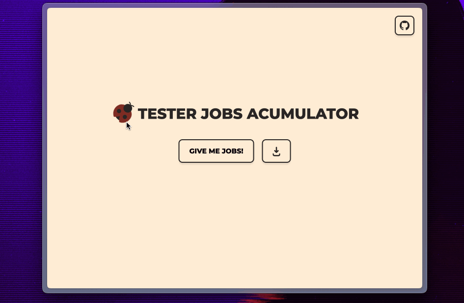

# 🐞 Tester Jobs Accumulator

Welcome to **Tester Jobs Accumulator**, a dynamic web application designed to help job seekers find the latest tester job opportunities by scraping popular employment websites. Built with a robust stack including Python, Beautiful Soup 4 (BF4), and FastAPI for backend operations and HTML, CSS, JavaScript with Tailwind CSS, and Alpine.js for a responsive frontend.
This application scrapes the latest job offers from the following websites:
 - [theprotocolit](https://theprotocol.it/)
 - [bulldogjob](https://bulldogjob.pl/)
 - [nofluffjobs](https://nofluffjobs.com/)
 - [justjoinit](https://justjoin.it/)

## ✨ Features

- **Job Scraping**: Automatically scrape and display the newest tester job listings from various popular job portals.
- **Live Demo**: Try out the app directly on the [Glitch platform](https://fate-stream-quiver.glitch.me/).
- **Interactive UI**: Users can interact with a sleek, modern interface to filter job listings according to specific needs or preferences.
- **Downloadable Content**: Download job listings in JSON or CSV formats directly from the website.

## 🛠 Tech Stack

- **Backend:** Python, [FastAPI](https://fastapi.tiangolo.com/)
- **Scraping Library:** [Beautiful Soup 4 (BS4)](https://www.crummy.com/software/BeautifulSoup/bs4/doc/)
- **Frontend:** HTML, CSS, JavaScript, [Tailwind CSS](https://tailwindcss.com/), [Alpine.js](https://alpinejs.dev/)

## 🚀 Getting Started

To get a local copy up and running follow these simple steps.

### Prerequisites

- Python 3.8+
- pip
- FastAPI
- Uvicorn (for running the API server)

### Installation

1. Clone the repo
   ```sh
   git clone https://github.com/jakestolarsky/tester_jobs_accumulator.git
   ```
2. Install required Python packages
   ```sh
   pip install -r requirements.txt
   ```
3. Run the application
   ```sh
   uvicorn app:main --reload
   ```

## 🎮 Usage

To start scraping jobs, simply visit the homepage and click on **GIVE ME JOBS!** button. The application will display the latest job listings which you can also download.

##  Thanks for all and I wish you best ✨